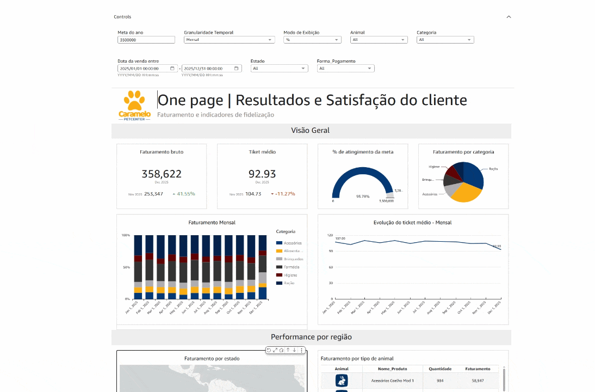
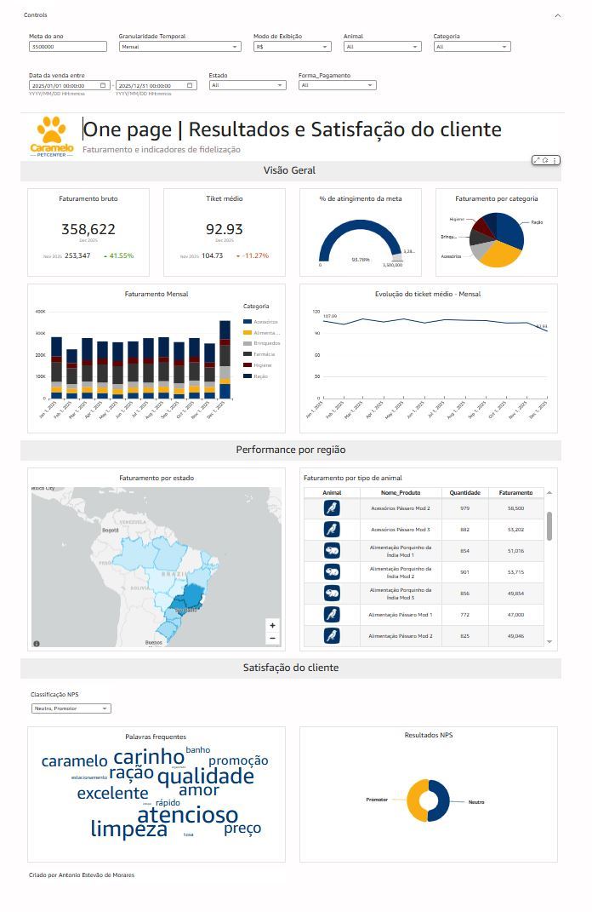
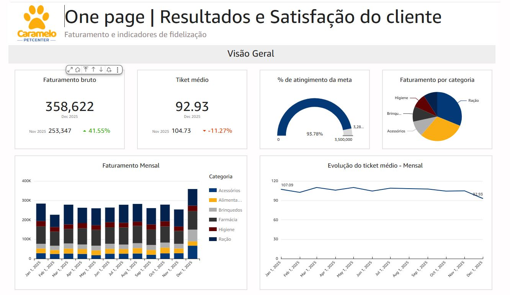
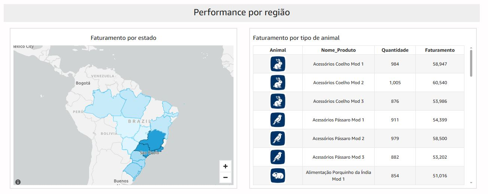
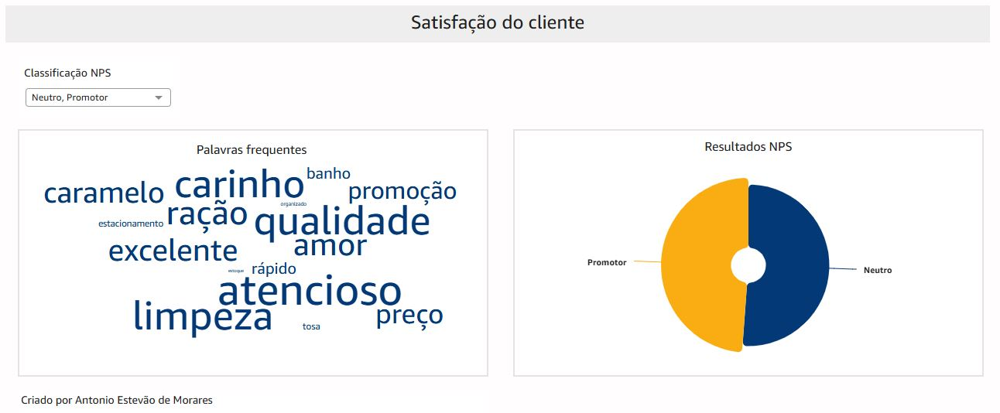

# AWS QuickSight Analytics Dashboard

Professional analytics dashboard project developed with AWS QuickSight focused on Data-Driven Decision Making and Exploratory Data Analysis (EDA).

---

## 📊 Project Overview

This project demonstrates the development of an interactive analytics dashboard using AWS QuickSight to transform raw data into actionable business insights.

The dashboard was designed with a focus on:

- Data visualization
- Exploratory Data Analysis (EDA)
- Interactive filters and parameters
- KPI monitoring
- Data-Driven Decision Making

---

## 🚀 Technologies Used

- AWS QuickSight
- AWS Cloud
- SQL
- Data Analytics
- Dashboard Design
- Business Intelligence

---

## 📈 Key Features

- Interactive dashboards
- Dynamic filtering
- Analytical visualizations
- Business KPI tracking
- Cloud-based analytics

---

## 🎥 Dashboard Preview

---

## 📸 Dashboard Overview

---

## 📈 KPI Analysis

---

## 🌎 Regional Performance Analysis

---

## 😊 Customer Satisfaction Analysis

---

## 📚 Learning Objectives

- Build professional dashboards
- Create interactive business reports
- Generate analytical insights
- Improve cloud analytics skills
- Support strategic decision-making

---

## 👨‍💻 Author

Antonio Estevao Moraes
